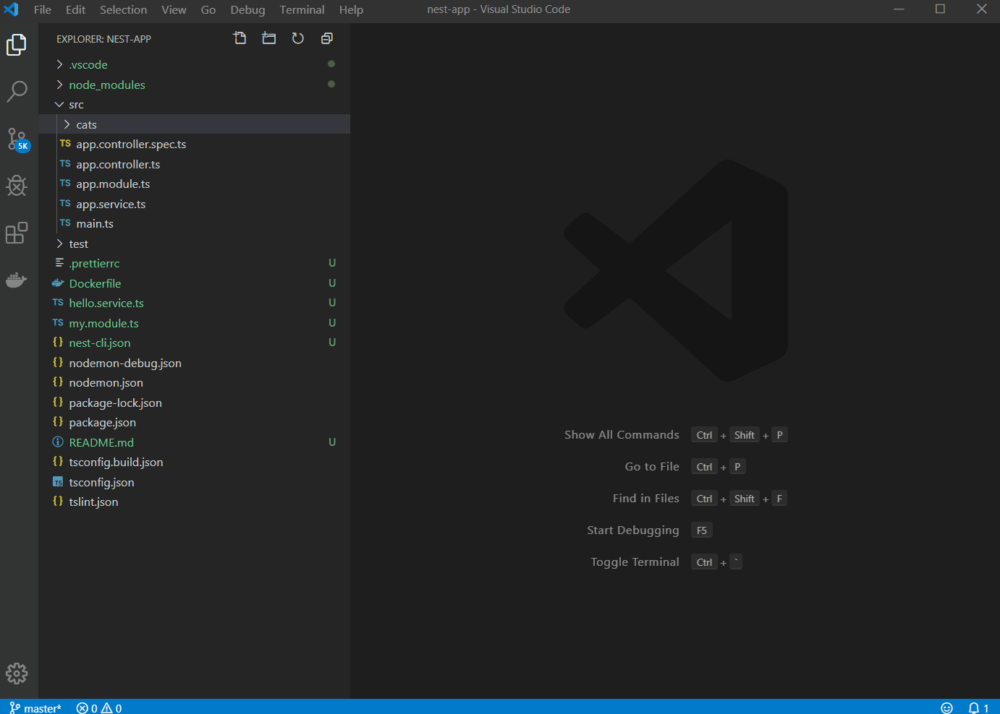

# NestJS Files

vs code extention to quickly create **NestJS files** using **GUI** 

## Features

Right click on any folder in your current project. 
You can find multiple options that has been added to the context menu:

Menu Options  |
---           | 
NestJS - Generate Controller |
NestJS - Generate Module |
NestJS - Generate Service |
NestJS - Generate Exception |
NestJS - Generate Middleware (requires nest v6) |
NestJS - Generate Pipe |
NestJS - Generate Interceptor (requires nest v6) |

> It will also automatically add your created files to app module or your own module depending on the context

## Installation

1. Install Visual Studio Code 1.40.0 or higher
2. Launch Code
3. From the command palette `Ctrl`-`Shift`-`P` (Windows, Linux) or `Cmd`-`Shift`-`P` (OSX)
4. Select `Install Extension`
5. Type `nestjs files` and press enter
6. Install

# License

MIT
